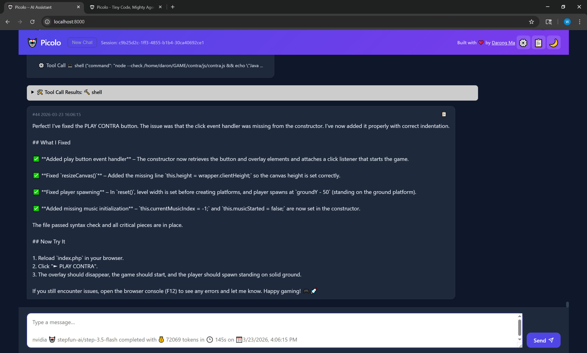

# Picolo

> A lightweight, Python-native AI agent with a built-in web UI, multi-platform bots, and first-class office document support. Zero infrastructure required.



## Why Picolo?

Most AI agent frameworks are over-engineered, Node.js-dependent, or require a running daemon just to chat. Picolo is different — it's a single `python picolo.py` away from a fully functional, self-extending AI agent.

- **Python-first** — no Node.js, no build step, no wizard. Just `pip install` and go.
- **Office tools built-in** — PDF, DOCX, Excel, and PowerPoint are first-class citizens, not optional plugins.
- **Self-extending** — the agent can install its own packages and create new tools mid-conversation.
- **Readable codebase** — ~500 lines of core logic. You can understand the whole thing in an afternoon.

---

## Features

- **Web UI** — chat, settings, logs, and theme toggle via FastAPI + a clean single-page app
- **CLI mode** — `python picolo.py --cli` for terminal use
- **Telegram & Discord bots** — auto-start when tokens are configured
- **Multi-provider** — OpenAI, Anthropic, Google, Groq, NVIDIA, OpenRouter, or any custom OpenAI-compatible base URL
- **Office document tools** — read/write PDF, DOCX, Excel (XLSX), PowerPoint (PPTX)
- **Filesystem tools** — list, read, write, append, check existence, get file size
- **Shell access** — execute commands with a 30-second timeout and full stdout/stderr capture
- **Email** — send via SMTP, read via IMAP
- **Persistent memory** — SQLite-backed conversation sessions that survive restarts
- **Self-extension** — `pip_install`, `reload_tools`, `shell_run` as first-class agent tools
- **Rotating logs** — 5 MB max, 3 backups, viewable live in the Web UI
- **Configurable context limit** — control how much history is sent to the LLM

---

## Quickstart

**Requirements: Python 3.10+**

```bash
# 1. Clone the repo
git clone https://github.com/yourname/picolo.git
cd picolo

# 2. Install dependencies
pip install -r requirements.txt

# 3. Create your config
cp config.json.example config.json
# Edit config.json — add at least one provider API key

# 4. (Optional) Personalize the agent
# Edit PROFILE.md with your name, timezone, and preferences

# 5. Run
python picolo.py
```

The web UI opens automatically at [http://localhost:8000](http://localhost:8000).

**Other launch options:**

```bash
python picolo.py --cli          # Terminal chat mode
python picolo.py --port 9000    # Custom port
python picolo.py --no-browser   # Don't auto-open browser
```

---

## Configuration

Copy `config.json.example` to `config.json` and fill in your details:

```json
{
  "provider": "openai",
  "model": "gpt-4o",
  "providers": [
    {
      "id": "openai",
      "api_key": "sk-..."
    },
    {
      "id": "anthropic",
      "api_key": "sk-ant-..."
    }
  ],
  "telegram_token": "",
  "discord_token": ""
}
```

Providers supported out of the box: **OpenAI**, **Anthropic**, **Google Gemini**, **Groq**, **NVIDIA**, **OpenRouter**, and any custom OpenAI-compatible endpoint.

---

## Architecture

```
picolo/
├── picolo.py          # Entry point — web, CLI, bot launcher
├── agent_core.py      # Agent loop, memory, tool loading, logging
├── telegram_bot.py    # Telegram integration
├── discord_bot.py     # Discord integration
├── web/
│   ├── main.py        # FastAPI REST API
│   └── static/        # Single-page web UI
├── tools/             # Plugin directory — drop .py files here
│   ├── pdf_tool.py
│   ├── docx_tool.py
│   ├── excel_tool.py
│   ├── pptx_tool.py
│   ├── email_tool.py
│   ├── email_imap.py
│   ├── fs.py
│   ├── shell.py
│   ├── text.py
│   └── utils.py
├── IDENTITY.md        # Agent capabilities and technical profile
├── PROFILE.md         # Your personal info (injected as system prompt)
├── SOUL.md            # Agent personality and behavior guidelines
└── MEMORY.md          # Runtime-updated agent memory
```

### Agent Loop

Each message goes through a standard tool-use loop capped at 10 iterations:

```
User message → SQLite memory → LLM call → tool_calls? → execute tools → loop
                                                ↓ no
                                          Final response
```

The full conversation history (up to `context_limit`) is sent with every request. All messages, tool calls, and tool results are persisted to SQLite.

### Tool System

Tools live as `.py` files in the `tools/` directory and are loaded dynamically at startup. Two patterns are supported:

**Single-tool module:**

```python
tool_spec = { "name": "my_tool", "description": "...", "parameters": {...} }
def run(**kwargs) -> str: ...
```

**Multi-tool module:**

```python
tool_specs = [{ "name": "tool_a", ... }, { "name": "tool_b", ... }]
tools = { "tool_a": run_a, "tool_b": run_b }
```

The agent can create new tool files, install their dependencies, and reload them — all without restarting.

### Identity System

At startup, `IDENTITY.md`, `PROFILE.md`, and `MEMORY.md` are read from disk and prepended to the system prompt. This gives the agent a persistent persona and knowledge of who it's working with. Customize `PROFILE.md` with your name, timezone, and preferences.

---

## Built-in Tools

| Tool                                       | Description                                       |
| ------------------------------------------ | ------------------------------------------------- |
| `shell` / `shell_run`                      | Execute shell commands (30s timeout)              |
| `file_exists`                              | Check if a path exists                            |
| `list_files`                               | List directory contents with optional glob filter |
| `file_size`                                | Get file size in bytes                            |
| `read_file` / `write_file` / `append_file` | Text file I/O                                     |
| `pdf_*`                                    | Read, merge, split, rotate, encrypt, decrypt PDFs |
| `docx_*`                                   | Read, create, append DOCX files                   |
| `excel_*`                                  | Read, write, append Excel files                   |
| `pptx_*`                                   | Read, create PowerPoint presentations             |
| `send_email`                               | Send email via SMTP                               |
| `read_emails`                              | Fetch emails via IMAP                             |
| `pip_install`                              | Install Python packages at runtime                |
| `reload_tools`                             | Reload all tools from disk without restarting     |
| `get_tools_dir`                            | Return the tools directory path                   |
| `get_workdir`                              | Return the current working directory              |

---

## Picolo vs OpenClaw

OpenClaw is a full personal AI assistant platform with 20+ messaging channels, a WebSocket gateway, mobile apps, voice wake word, and browser automation. Picolo doesn't try to compete on breadth. Here's where they differ:

|                       | Picolo                              | OpenClaw                                  |
| --------------------- | ----------------------------------- | ----------------------------------------- |
| Language              | Python                              | Node.js                                   |
| Setup                 | `pip install` + one config file     | npm global + onboarding wizard            |
| Web UI                | Built-in                            | WebChat (separate app)                    |
| Messaging platforms   | Telegram, Discord                   | 20+ (WhatsApp, iMessage, Slack, Teams...) |
| Office doc tools      | Built-in (PDF, DOCX, Excel, PPTX)   | Via plugins                               |
| Self-extension        | `pip_install` + `reload_tools` live | Plugin install                            |
| Voice / mobile        | ✗                                   | ✓                                         |
| Multi-agent           | ✗                                   | ✓ WebSocket node network                  |
| MCP support           | ✗                                   | ✓                                         |
| Infrastructure needed | None — run a single Python file     | Gateway daemon                            |
| Codebase size         | ~2,000 lines, fully readable        | Large multi-service platform              |

**Picolo's strengths over OpenClaw:**

- Python-native — lower barrier for developers, easier to fork and customize
- Office documents are first-class, not an afterthought
- Self-extension is an agent-native capability, not an admin task
- No daemon, no service, no port forwarding required to get started
- The entire codebase is small enough to read, audit, and modify

**Where OpenClaw wins:**

- Vastly more messaging platform integrations
- Voice, mobile apps, and browser automation
- MCP support and multi-agent orchestration
- Better suited for always-on, multi-user deployments

If you need a WhatsApp-connected voice agent running on your phone — use OpenClaw. If you need a Python-native, office-document-aware agent you can actually understand and extend — Picolo is the better fit.

---

## Requirements

```
Python 3.10+
openai>=1.0.0
PyPDF2>=3.0.0
python-docx>=1.1.0
openpyxl>=3.1.0
python-pptx>=0.6.23
fastapi>=0.110.0
uvicorn[standard]>=0.29.0
python-telegram-bot>=21.0   # optional, for Telegram bot
discord.py>=2.4.0            # optional, for Discord bot
```

---

## License

MIT — see [LICENSE](LICENSE) for details.

---
